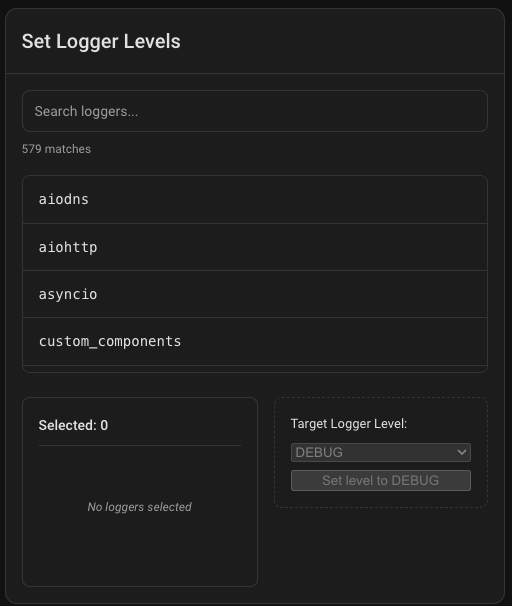
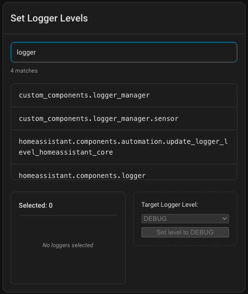
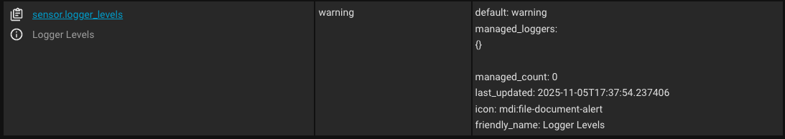

<div align="center">


# Logger Manager

A Home Assistant integration for managing logging levels

[](https://github.com/hacs/integration)
[](https://github.com/gunnjr/ha-logger-manager/releases)
[](LICENSE)

</div>

---

> **Note**: This is my first published Home Assistant integration. While it works and is useful, it may need improvements and hardening as more people use it. Feedback, issues, and contributions are welcome!

---

## What It Does

**The main value of Logger Manager is its UI card** that makes changing logger levels easier than using Developer Tools. It also provides a sensor that tracks which loggers you've customized and services that remember your changes across restarts.

When debugging Home Assistant, you often need to enable debug logging for specific integrations. The native way requires typing logger names into Developer Tools. Logger Manager's UI card gives you a searchable dropdown of available loggers and buttons to change levels - much faster and less error-prone.

## Key Feature: The UI Card



The Logger Manager card provides:
- **Searchable multi-select dropdown** of all available loggers
- **One-click level changes** (Critical, Error, Warning, Info, Debug)
- **Visual feedback** on current logger states
- **Bulk operations** - change multiple loggers at once

This is the primary reason to use Logger Manager. The backend services and sensor exist to support the UI, but the UI is where the real value lies.



## Secondary Features

### Logger State Sensor



A sensor (`sensor.logger_levels`) that tracks:
- Current default log level
- List of loggers you've customized and their levels
- Count of customized loggers
- Updates every 10 seconds

### Services

#### `logger_manager.apply_levels`

Change log levels for one or more loggers. Similar to HA's built-in `logger.set_level` but maintains a list of managed loggers for the UI.

```yaml
service: logger_manager.apply_levels
data:
  level: debug
  loggers:
    - homeassistant.components.zha
    - custom_components.logger_manager
```

#### `logger_manager.refresh_logger_cache`

Manually refresh the list of available loggers (normally refreshes every 30 minutes automatically).

## Installation

### Via HACS

1. Open HACS → Integrations
2. Add custom repository: `https://github.com/gunnjr/ha-logger-manager`
3. Download "Logger Manager"
4. Restart Home Assistant
5. Add integration: Settings → Devices & Services → Add Integration → Logger Manager

### Manual

1. Copy `custom_components/logger_manager` to your HA `config/custom_components/` directory
2. Restart Home Assistant
3. Add integration: Settings → Devices & Services → Add Integration → Logger Manager

## Setup

### Adding the Integration

1. Go to Settings → Devices & Services
2. Click Add Integration
3. Search for "Logger Manager"
4. Click Submit (no configuration needed)

You'll see:
- `sensor.logger_levels` entity created
- Services registered under `logger_manager`

### Adding the UI Card

The UI card should be automatically available after installation. To add it to your dashboard:

1. Edit your dashboard
2. Add Card → Search for "Logger Manager Card"
3. Add the card

If the card doesn't appear, hard-refresh your browser (Ctrl+F5 or Cmd+Shift+R).

Alternatively, add via YAML:
```yaml
type: custom:ha-logger-multiselect-card
entity: sensor.logger_levels
```

## Usage

### Via UI Card (Recommended)

1. Open the card on your dashboard
2. Use the dropdown to select loggers (search and multi-select supported)
3. Click a log level button
4. Click Apply

### Via Service

```yaml
service: logger_manager.apply_levels
data:
  level: debug
  loggers:
    - homeassistant.components.mqtt
    - custom_components.logger_manager
```

### Common Logger Names

**Core integrations:**
```
homeassistant.components.<integration_name>
```
Examples: `homeassistant.components.zha`, `homeassistant.components.mqtt`

**Custom integrations:**
```
custom_components.<integration_name>
```
Examples: `custom_components.logger_manager`, `custom_components.hacs`

**System loggers:**
```
homeassistant.core
homeassistant.loader
homeassistant.setup
```

## Planned Enhancements

Future versions will add:

### v1.1: Configurable Logger Discovery
- Make logger discovery patterns configurable
- Currently hardcoded to find HA core, custom components, and system loggers
- Will allow users to add custom patterns for third-party libraries

### v1.2: Logger Management UI
- View all managed loggers in a dedicated interface
- Edit or remove managed logger levels
- See history of changes

### v1.3: Default Log Level Control
- UI to change Home Assistant's default log level
- Currently can only be changed via configuration.yaml

### v2.0: Integrated Dashboard
- Pre-built dashboard combining all Logger Manager features
- One-stop shop for all logging needs

No timeline promised - these will come as time permits and based on user feedback.

## Limitations

- Loggers must exist for level changes to take effect
- Some third-party libraries may not follow HA logging conventions
- The sensor updates every 10 seconds, not instantly
- WebSocket API for logger discovery caches results for 30 minutes
- Logger discovery patterns are currently hardcoded (v1.1 will make this configurable)

## Requirements

- Home Assistant ≥ 2024.6.0

## Troubleshooting

**UI Card Not Showing:**
- Hard refresh browser (Ctrl+F5 or Cmd+Shift+R)
- Check browser console for errors
- Verify integration is installed and loaded

**Logger Not in Dropdown:**
- Use `logger_manager.refresh_logger_cache` service
- Verify the integration/logger is actually loaded in HA
- Some third-party libraries may not appear if they don't follow standard naming

**Levels Not Persisting:**
- Logger Manager stores state in `.storage/logger_manager`
- Check file permissions if levels disappear after restart

## Contributing

This is a learning project and my first HA integration. Contributions, suggestions, and constructive feedback are very welcome:
- Report issues
- Suggest improvements
- Submit pull requests
- Share usage patterns

## License

MIT License - see [LICENSE](LICENSE) file for details.

---

<div align="center">

**[⬆ Back to Top](#logger-manager)**

Built for Home Assistant developers and power users

</div>
